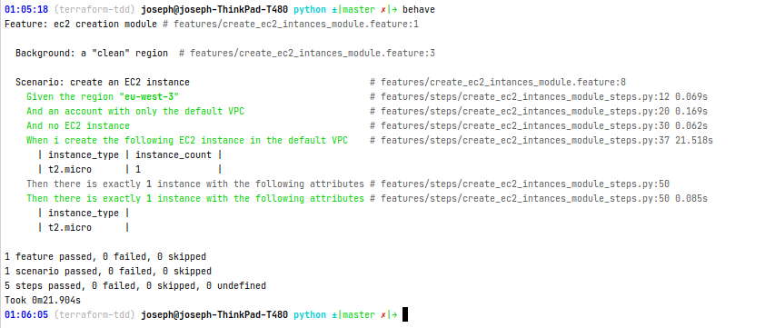

---
title: Behaviour-Driven Infrastructure-as-Code &#x2764;
date: 12:00 12/31/2020
author: Joseph M'Bimbi-Bene
hero_classes: 'text-light overlay-dark-gradient'
hero_image: logo.png
taxonomy:
category: blog
tag: [devops, bdd]
---

Dans cette article, nous allons investiguer la testabilité de modules `Terraform` en y ajoutant du `Cucumber`.

===

Certains esprits arriérés pourraient répondre que ce sont 2 choses qui n'ont rien à voir.
Les tests unitaires / TDD, c'est pour le code, cucumber c'est pour le fonctionnel / métier, hors là c'est du pur technique.

Je répondrais à ces gens qu'ils n'ont pas compris grand chose à pourquoi on fait du test. 
Et que c'est un mini-projet exploratoire, je pense que c'est réutilisable plus ou moins as-is, sinon à refiner. 
Mais surtout, ne pas jeter le bébé avec l'eau du bain.

TDD: du code fiable, grande couverture de test, feedback hyper rapide. 
Cucumber: des specs éxécutables, automatisables. 
Tout cela marche très bien pour le fonctionnel "pur", ainsi que pour le code de l'application, et ça marche tout aussi bien pour le code d'infra aussi.
Ce n'est pas une question de "métier / technique", ou autre.

### Sommaire

- [Introduction, Description du projet](#introduction-description-du-projet)
- [Le test en `Gherkin` / `Cucumber`](#le-test-en-gherkin-cucumber)
- [Résultat de l'éxécution des tests](#résultat-de-l-éxécution-des-tests)
  * [En java](#en-java)
  * [En python](#en-python)
- [Arborescence de fichier](#arborescence-de-fichier)
- [Références](#références)

<small><i><a href='http://ecotrust-canada.github.io/markdown-toc/'>Table of contents generated with markdown-toc</a></i></small>


###  <a name="introduction-description-du-projet"></a>œ Introduction, Description du projet

Le but de ce projet est de chercher à appliquer une approche TDD à de "l'infra as code". \
Pour Démarrer, on va juste chercher à créer en TDD une instance EC2 dans un compte AWS de test. \
On élaborera des cas plus sophistiqués par la suite.

Les tests sont décrits avec `Cucumber` / `Gherkin`, et il y a une implémentation des steps:
- en Python
- en Java

Par la suite, nous essaierons d'implémenter des tests via `Terratest`. \
On investiguera s'il y a une implémentation `go` de `Cucumber` et s'il est possible de le mixer avec `Terratest`
pour avoir une "single source of truth" / "golden source" quant à la spécification des tests, et ce même cross-langage !

### <a name="le-test-en-gherkin-cucumber"></a> Le test en `Gherkin` / `Cucumber`

```gherkin
Feature: ec2 creation module

  Background: a "clean" region
    Given the region "eu-west-3"
    And an account with only the default VPC
    And no EC2 instance

  Scenario: create an EC2 instance
    When i create the following EC2 instance in the default VPC
      | instance_type | instance_count |
      | t2.micro      | 1              |
    Then there is exactly 1 instance with the following attributes
      | instance_type |
      | t2.micro      |
```

### Résultat de l'éxécution des tests
Voici des captures d'écran de l'éxécution de ces tests

#### En java
##### Via l'IDE

Configuration de l'IDE:


Résultats:


##### Via la CLI


#### En python



### Arborescence de fichier

```shell
tree -L 3 -I "terraform-tdd|terraform-tdd-helloworld-poc.iml|*tfstate*" --dirsfirst
.
├── examples
│   └── default
│       ├── main.tf
│       └── variables.tf
├── test
│   └── default
│       ├── java
│       ├── python
│       └── create_ec2_intances_module.feature
├── main.tf
├── outputs.tf
├── README.md
└── variables.tf

```

### Références

- [How to Build Reusable, Composable, Battle tested Terraform Modules](https://www.youtube.com/watch?v=LVgP63BkhKQ)
- [5 Lessons Learned From Writing Over 300,000 Lines of Infrastructure Code](https://www.youtube.com/watch?v=RTEgE2lcyk4)